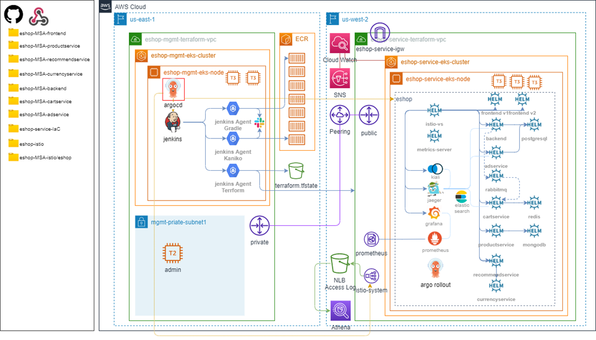

# eshop-PaC
Cloud/MSA CI/CD istio 실습용 eshop의 PaC형태의 Repository 레퍼런스

<br>

# main branch - 2일차 레퍼런스

<br>


<br>


# eshop-PaC의 AWS Architecture

<br>



<br>


### deployment pod 재기동.

<br>

```bash
kubectl -n eshop rollout restart deployment eshop-adservice
kubectl -n eshop rollout restart deployment eshop-backend
kubectl -n eshop rollout restart deployment eshop-cartservice
kubectl -n eshop rollout restart deployment eshop-currencyservice
kubectl -n eshop rollout restart deployment eshop-frontend
kubectl -n eshop rollout restart deployment eshop-productservice
kubectl -n eshop rollout restart deployment eshop-recommendservice
kubectl -n eshop rollout restart deployment postgres
kubectl -n eshop rollout restart deployment rabbitmq
kubectl -n eshop rollout restart deployment redis
kubectl -n eshop rollout restart statefulset mongodb
```

<br>
<br>

### eshop namespace istio injection

<br>

참고. 만일 `eshop` namespace가 없는경우만 실행
>```bash
>kubectl create namespace eshop
>```

<br>

```bash
kubectl label namespaces eshop istio-injection=enabled
```
```bash
kubectl get namespaces -L istio-injection
```

<br>
<br>


### 참고. istio의 간헐적인 OutofSync 해결법

<br>

- 참고 url. https://argo-cd.readthedocs.io/en/release-1.8/user-guide/diffing/

- 참고 url. https://github.com/argoproj/argo-cd/issues/4276
- istio manifest

```yaml
(...생략...)
syncPolicy:
  syncOptions:
    - CreateNamespace=true
(입력)
```
- argocd(CD툴)에서는 istio의 ValidatingWebhookConfiguration 및 MutatingWebhookConfiguration의 caBundle값을 다이나믹하게 삭제되는 변화를 감지한다. Auto Pruning이 없는 상황에서 잦은 istio 상기 설정(caBundle, failurePolicy)의 삭제되어야 하는 부분 발생으로 OutofSync가 발생하게 되는 것이다. 이를 무시하기 위한 옵션을 아래와 같이 manifest에 추가해주게 되면 해당 변화에 대해서는 argocd가 감지하지 않는다.

- istio의 App Details 버튼을 누른 후 Manifest 탭에서 Edit을 클릭하면 위와 같이 manifest가 표출된다.
- 그 후 상기 Manifest의 (입력)란에 아래 코드 입력 (ignoreDifferences는 syncPolicy와 동일 depth)

```yaml
ignoreDifferences:
  - group: admissionregistration.k8s.io
    kind: ValidatingWebhookConfiguration
    jsonPointers:
      - /webhooks/0/clientConfig/caBundle
      - /webhooks/0/failurePolicy
  - group: admissionregistration.k8s.io
    kind: MutatingWebhookConfiguration
    jsonPointers:
      - /webhooks/0/clientConfig/caBundle
      - /webhooks/1/clientConfig/caBundle
      - /webhooks/2/clientConfig/caBundle
      - /webhooks/3/clientConfig/caBundle
```


<br>
<br>


### change global helm vars (eshop/values.yaml)

<br>

```yaml
global.images.* : << ECR URI >>/<< SERVICE NAME >>:<< TAG >>
```

<br>
<br>

### istio helm setting

<br>

```yaml
global:
  eiparn: <<EIP ARN1>>,<<EIP ARN2>>
  sslcert: <<ACM ARN>>
```

<br>
<br>

### istio 배포 수행 후 Route53 Record를 설정한다.

Route53 서비스에 접근하여 Create Record 작업을 수행한다.

- eshop.<< DOMAIN NAME >>     
> alias switch on    
> Alias to Network Load Balancer 선택    
> Oregon(us-west-2) 선택    
> Network LoadBalancer 선택    

<br>
<br>

### grafana

<br>

<< DOMAIN >> 변수 : 개인이 설정한 eshop 서비스 도메인의 FQDN(Fully Qualified Domain Name)값

> ex) eshop.mspt3.click


접근 URL    
https://<< DOMAIN >>/grafana    

eshop-PaC/eshop/charts/grafana/values.yaml
275 Line에 ID/PW 설정

해당 ID/PW로 Login 인증

<br>
<br>

### kiali

<br>

<< DOMAIN >> 변수 : 개인이 설정한 eshop 서비스 도메인의 FQDN(Fully Qualified Domain Name)값

> ex) eshop.mspt3.click

접근 URL    
https://<< DOMAIN >>/kiali    

- 본 과정에서 OAuth2 인증 등을 다루지 않는 사유로, 아래와 같이 Path DENY 정책을 걸어둠
- Open Tracing 테스트 시에만 임시적으로 열고 평시에는 닫아놓는 것을 권장
- eshop-PaC/eshop/charts/istio-authz/templates/kiali-auth-policy.yaml
```yaml
## istio AuthorizationPolicy으로 무인증 접근을 막음.
apiVersion: security.istio.io/v1beta1
kind: AuthorizationPolicy
metadata:
  name: kiali-ingress-policy
  namespace: istio-system
spec:
  selector:
    matchLabels:
      app: istio-ingressgateway
  action: DENY
  rules:
    # IP Base ACL 미동작
    # - from:
    #   - source:
    #       ipBlocks:
    #       - 121.133.133.0/24
    #       - 221.167.219.0/24
    - to:
      - operation:
          paths: [
            "/kiali*"
          ]
```

<br>
<br>

### jaeger-query

<br>

<< DOMAIN >> 변수 : 개인이 설정한 eshop 서비스 도메인의 FQDN(Fully Qualified Domain Name)값

> ex) eshop.mspt3.click

접근 URL    
https://<< DOMAIN >>/jaeger 

<br>

- 본 과정에서 OAuth2 인증 등을 다루지 않는 사유로, 아래와 같이 Path DENY 정책을 걸어둠
- Open Tracing 테스트 시에만 임시적으로 열고 평시에는 닫아놓는 것을 권장
- eshop-PaC/eshop/charts/istio-authz/templates/jaeger-auth-policy.yaml
```yaml
## istio AuthorizationPolicy으로 무인증 접근을 막음.
apiVersion: security.istio.io/v1beta1
kind: AuthorizationPolicy
metadata:
  name: jaeger-ingress-policy
  namespace: istio-system
spec:
  selector:
    matchLabels:
      app: istio-ingressgateway
  action: DENY
  rules:
    # IP Base ACL 미동작
    # - from:
    #   - source:
    #       ipBlocks:
    #       - 121.133.133.0/24
    #       - 221.167.219.0/24
    - to:
      - operation:
          paths: [
            "/jaeger*"
          ]
```

<br>
<br>

### prometheus-server (ClusterIP to LoadBalancer)

<br>

🗎 참고. prometheus-server service의 서비스 타입 변경 커맨드
>
>```
>kubectl patch service eshop-prometheus-server -n eshop -p '{"spec": {"type": "LoadBalancer"}}'
>```

<br>

🗎 참고. prometheus-server service의 LoadBalancer ELB DNS Name 확인
>
>```
>kubectl get svc -n eshop | grep prometheus-server
>```

<br>

🗎 참고. prometheus-server service의 서비스타입 영구 변경
>
>=> prometheus의 Helm Chart 설정값을 변경한다.
>
>prometheus > values.yaml > 939 line     
>type: LoadBalancer 로 변경
>

접근 URL    
http://<< prometheus CLB DNS Name >>

<br>

<span style="color:red">권장 작업</span>    

  각각 기존 any open 0.0.0.0/0 엔트리를 모두 삭제하고, 아래를 Security Group 엔트리에 추가한다.

  (Prometheus)    
  Source: << MyIP >>/32    
  Port: 80    
  Protocol: TCP    
  
<br># eshop-PaC
